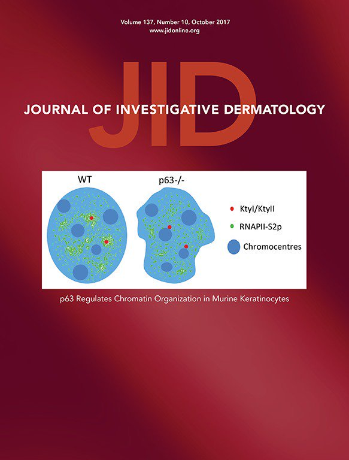

---
output:
  html_document: 
    toc: true
    toc_float: true
---

<link rel="stylesheet" href="styles.css" type="text/css">

## University of Bradford

**Research Interests:**
Bioinformatics, Biostatistics, Digital health, Epigenetics, Genomics, Skin

### Selected publications

The below publications represent our work to date on the topic of statistical methods for the study of etiologic heterogeneity:

Murat, K., Gruning, B., Poterlowicz, P.W., Westgate, G., Tobin, D.J. and Poterlowicz, K., 2019. EWAS-Galaxy: a tools suite for population epigenetics integrated into Galaxy. bioRxiv, p.553784.

Akhbari P, Tobin D, Poterlowicz K, Roberts W, Boyne JR. MCV-miR-M1 targets the host-cell immune response resulting in the attenuation of neutrophil chemotaxis. 
J Invest Dermatol. 2018 May 16. pii: S0022-202X(18)31958-4. doi:10.1016/j.jid.2018.03.1527. [Epub ahead of print] PubMed PMID: 29777657.

 

Stakaitytė G, Nwogu N, Lippiat JD, Blair GE, Poterlowicz K, Boyne JR, Macdonald A, Mankouri J, Whitehouse A. The cellular chloride channels CLIC1 and CLIC4 contribute to virus-mediated cell motility. J Biol Chem. 2018 Mar 23;293(12):4582-4590. doi: 10.1074/jbc.RA117.001343. Epub 2018 Feb 8. PubMed PMID: 29462791; PubMed Central PMCID: PMC5868249.

 

Alharbi RA, Pandha HS, Simpson GR, Pettengell R, Poterlowicz K, Thompson A, Harrington K, El-Tanani M, Morgan R. Inhibition of HOX/PBX dimer formation leads to necroptosis in acute myeloid leukemia cells. Oncotarget. 2017 Aug 7;8(52):89566-89579. doi: 10.18632/oncotarget.20023. eCollection 2017 Oct 27.PubMed PMID: 29163771; PubMed Central PMCID: PMC5685692.

 

Poterlowicz K, Yarker JL, Malashchuk I, Lajoie BR, Mardaryev AN, Gdula MR, Sharov AA, Kohwi-Shigematsu T, Botchkarev VA, Fessing MY. "5C analysis of the Epidermal Differentiation Complex locus reveals distinct chromatin interaction networks between gene-rich and gene-poor TADs in skin epithelial cells." PLoS Genet. 2017 Sep 1;13(9):e1006966. doi: 10.1371/journal.pgen.1006966. eCollection 2017 Sep. PubMed PMID: 28863138.

 

Alharbi RA, Pandha HS, Guy R. Simpson GR, Pettengell R, Poterlowicz K, Thompson A, Harrington K, El-Tanani M, Morgan R. "Inhibition of HOX/PBX dimer formation leads to necroptosis in acute myeloid leukemia cells." Oncotarget. 2017; 8:89566-89579. https://doi.org/10.18632/oncotarget.20023

 

Rapisarda V, Malashchuk I, Asamaowei IE, Poterlowicz K, Fessing MY, Sharov AA, Karakesisoglou I, Botchkarev VA, Mardaryev A. "p63 transcription factor regulates nuclear shape and expression of nuclear envelope-associated genes in epidermal keratinocytes." J Invest Dermatol. 2017 Oct;137(10):2157-2167 doi:10.1016/j.jid.2017.05.013. Epub 2017 Jun 6. PubMed PMID: 28595999; PubMed Central PMCID: PMC5610935.

 

Mardaryev AN, Liu B, Rapisarda V, Poterlowicz K, Malashchuk I, Rudolf J, Sharov AA, Jahoda CA, Fessing MY, Benitah SA, Xu GL, Botchkarev VA. "Cbx4 maintains the epithelial lineage identity and cell proliferation in the developing stratified epithelium". J Cell Biol. 2016

Ahmed MI, Alam M, Emelianov VU, Poterlowicz K, Patel A, Sharov AA, Mardaryev, AN, Botchkareva NV. "MicroRNA-214 controls skin and hair follicle development by modulating the activity of the Wnt pathway". J Cell Biol. 2014 

T.Y. Sharova,K. Poterlowicz, N.V. Botchkareva , N.A. Kondratiev, A. Aziz, J.H. Spiegel, V.A. Botchkarev, A.A. Sharov "Complex changes in the apoptotic and cell differentiation programs duri ng initiation of the hair follicle response to chemotherapy" , Journal of Investigative Dermatology, 2014

 

A.N. Mardaryev, M.R. Gdula , J.L. Yarker , V.N. Emelianov, K. Poterlowicz , A.A. Sharov, T.Y. Sharova, J.A. Scarpa, P. Chambon, V.A. Botchkarev, M.Y. Fessing "p63 and Brg1 control developmentally regulated higher-order chromatin remodelling at the epidermal differentiation complex locus in epidermal progenitor cells", Development, 2014

 

C.J. Lewis, A.N. Mandrayev, K. Poterlowicz, T.Y. Sharova, A. Aziz, D.T. Sharpe, N.V. Botchkareva, A.A Sharov “Bone Morphogenetic Protein Signalling Suppresses wound-Induced Skin Repair by Inhibiting Keratinocyte Proliferation and Migration”, Journal of Investigative Dermatology, 2013

 

M.R. Gdula, K. Poterlowicz, A.N. Mandrayev, A.A. Sharov, Y. Peng, M.Y. Fessing, V.A. Botchkarev “Remodelling of three-dimensional organization of the nucleus during terminal keratinocyte differentiation in the epidermis”, Journal of Investigative Dermatology, 2013

 

T. Kohwi-Shigematsu, K. Poterlowicz, E. Ordinario, H.J. Han, V.A. Botchkarev, Y. Kohwi “Genome organizing function of SATB1 in tumor progression.” Seminars in Cancer Biology, 2012 

 

J. Laubenthal, O. Zlobinskaya*, K. Poterlowicz*, M.R. Gdula, J.O. Linschooten, E. Fthenou, A. Baumgartner, F.J. van Schooten, T.E. Schmid, R.W. Godschalk and D. Anderson “Cigarette smoke-induced transgenerational alterations in genome stability in cord blood of human F1 offspring”, FASEB, 2012 Oct:26(10):3946-56 (* equal contribution) 

 

K.M. McMahon, M. Volpato, H.Y. Chi, P. Musiwaro, K. Poterlowicz, Y. Peng, A.J. Scally, L.H. Patterson, R.M. Phillips, C.W. Sutton “Characterization of changes in the proteome in different regions of 3D multicell tumor spheroids” Journal of Proteome Research, 2012 May;11(5):2863-75 

 

A.N. Mandrayev, N. Meier, K. Poterlowicz, A.A. Sharov, T. Sharova, M.I. Ahmed, V. Rapisarda, C. Lewis, M.Y. Fessing, T.M. Ruenger, J. Bhawan, S. Werner, R. Paus and V.A. Botchkarev “Lhx2 differentially regulates Sox9, Tcf4 and Lgr5 in hair follicle stem cells to promote epidermal regeneration after Injury” Development, 2011 Nov;138(22):4843-52 

 

M.Y. Fessing, A.N. Mandrayev, M.R. Gdula, A.A. Sharov, T Sharova, V. Rapisadra, K.B. Gordon, A.D Smorodchenko, K. Poterlowicz, G. Ferone, Y. Kohwi, C. Missero, T. Kohwi-Shigematsu and V.A. Botchkarev “p63 Regulates Satb1 to control Tissue-Specific Chromatin Remodeling during Development of the Epidermis”, Journal of Cell Biology, 2011 Sep;194(6):825-39.

 

 M.Y. Fessing, R. Atoyan, B. Shander, A.N. Mandrayev, V.V. Jr Botchkarev, K. Poterlowicz, Y. Peng,  T. Efimova and V.A. Botchkarev “Bmp signaling induces cell-type specific changes in gene expression programs of human keratinocytes and fibroblasts”, Journal of Investigative Dermatology, 2010 Feb;130(2):398-404. 

## [Google scholar](https://scholar.google.co.uk/citations?user=46KP3twAAAAJ&hl=en)

A full list of publications is available at the above Google scholar link.

