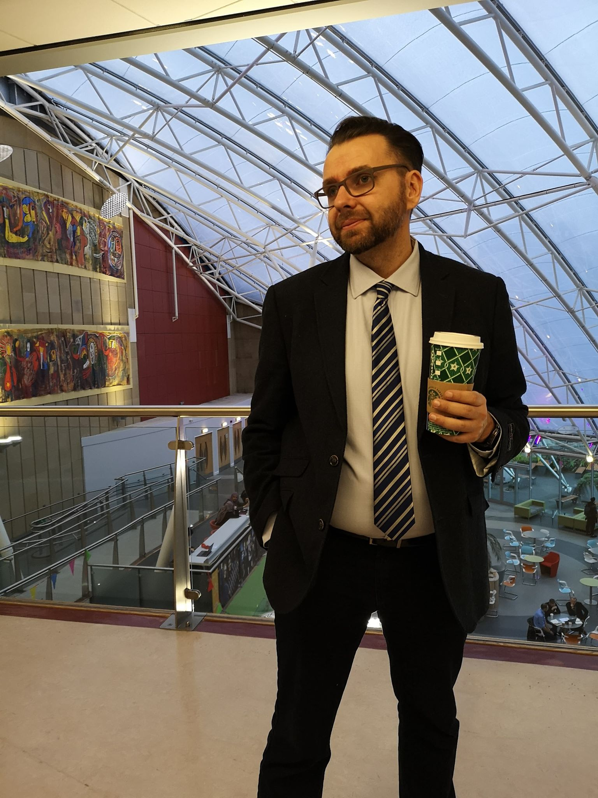

---
output:
  html_document: 
    toc: true
    toc_float: true
---

<link rel="stylesheet" href="styles.css" type="text/css">

## Dr Krzysztof Poterlowicz

Dr Poterlowicz graduated in mathematics and applied statistics at the Wroclaw University in Poland. He further continued his education at the University of Bradford studying computational modelling of the yeast cell cycle and obtained a MPhil degree in Bioinformatics. 

In 2009 he visited the Biotechnology Research Institute of the National Research Council Canada where his research involved computer simulation of molecular signalling cascades governing the development and differentiation of skin appendages. 

In 2010 he was awarded a ESPRC PhD fellowship in the Centre of Skin Sciences,  University of Bradford. This allowed him to develop an expertise in bioinformatics and computational biology of transcriptional and epigenetic regulation in the epidermis. His PhD research project on the  bioinformatics analyses of multi-level transcriptional  and epigenetic regulation of  epidermis together with internal and external collaborations resulted in a number of published articles in journals such as Journal of Cell Biology, FASEB, Development and Journalof Investigative Dermatology. Dr Poterlowicz was awarded the Best Paper Prize at the World Congress of Hair Research in Edinburgh in 2013. The same year he joined the Faculty of Life Sciences at the University of Bradford asa Lecturer in Bioinformatics. Dr Poterlowicz teaches computational biology, medical genetics and statistics and actes as a personal tutor to first year students of the biomedical science undergraduate program. He is a research active academic with interest in the identification of novel genomics biomarkers that influence tissue development and disease. He is involved in the international scientific collaborations (MRC UK-China Stem Cell Partnership Initiative grant) and his research is regulatory published in peer-review journals. Dr Poterlowicz actively works in the international   focus groups with aim to develop and provide bioinformatics and medical informatics training for biomedical students and staff. He is an Associate Member of the EpiGenSys and a Member of the Royal Society of Biology.

## Miss Katarzyna Murat

Kasia obtained a BSc degree in Bioinformatics at the University of Gdansk in 2016 and continued her studies for a MPhil degree in University of Bradford, working in our group on the workflow and tools for epigenetic profiling of progressing melanoma. She graduated with an MPhil degree in 2018. Her current PhD work is focused on the investigation of the skin disorders epigenetics.